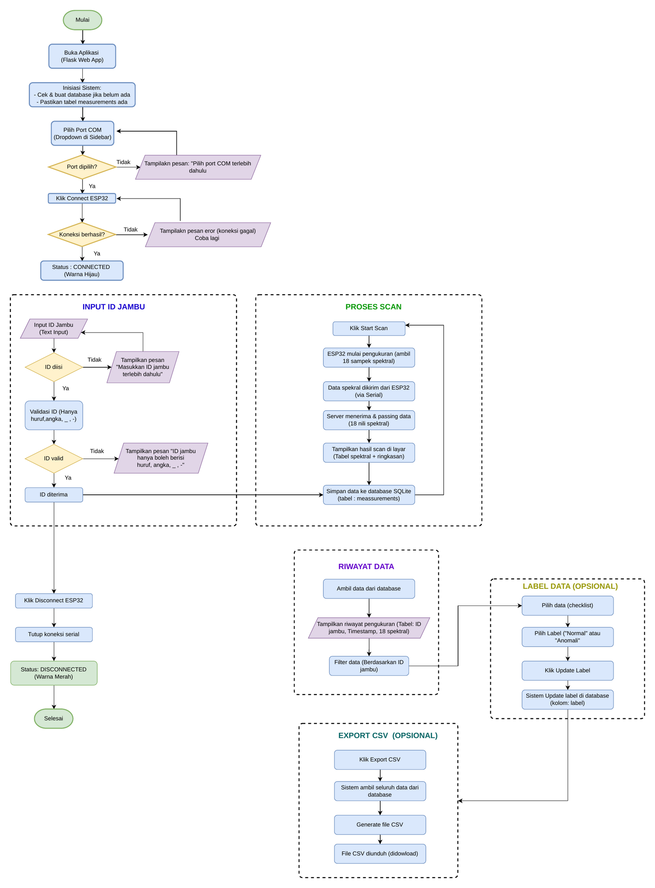
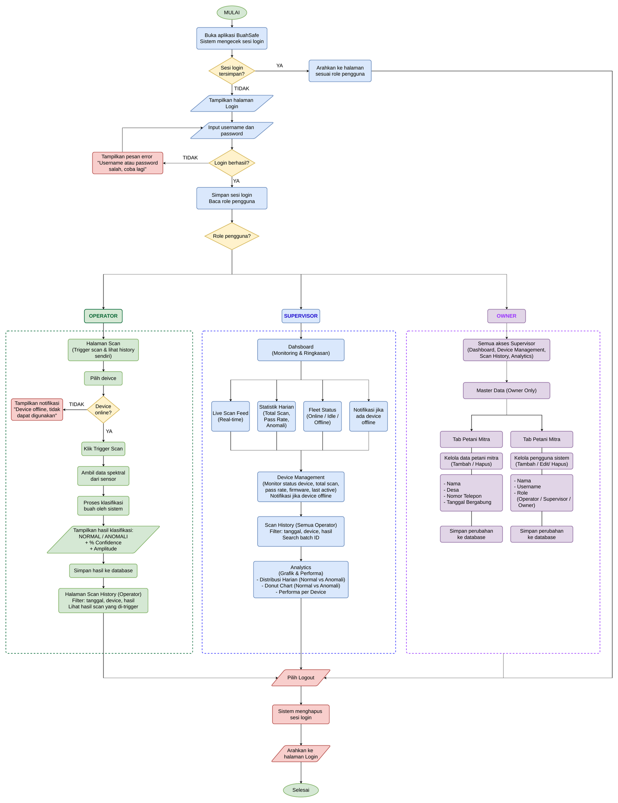

# BuahSafe Data Collector


Aplikasi web lokal untuk mengumpulkan dataset spektral jambu biji (guava) dari sensor **AS7265x 18-kanal** yang dikendalikan oleh **ESP32**. Setiap klik "Ambil satu scan" menyalakan penyinaran halogen, membaca 18 nilai spektral (410–940 nm), dan menyimpannya sebagai satu baris record di SQLite — siap untuk diberi label dan diekspor sebagai dataset CSV.

Versi saat ini (`v1.0.0`) adalah alat akuisisi data satu-operator (single-machine). Beberapa kapabilitas yang lebih luas — login multi-role, manajemen armada perangkat, dashboard analitik — ada di [Roadmap](#roadmap) sebagai arah pengembangan, **belum** diimplementasikan.

## Daftar Isi

- [Fitur](#fitur)
- [Alur Kerja](#alur-kerja)
- [Prasyarat](#prasyarat)
- [Perangkat Keras & Wiring](#perangkat-keras--wiring)
- [Instalasi](#instalasi)
- [Menjalankan Aplikasi](#menjalankan-aplikasi)
- [Cara Pakai](#cara-pakai)
- [Struktur Proyek](#struktur-proyek)
- [Skema Data & Ekspor CSV](#skema-data--ekspor-csv)
- [Testing](#testing)
- [Dokumentasi Lengkap](#dokumentasi-lengkap)
- [Keterbatasan yang Diketahui](#keterbatasan-yang-diketahui)
- [Roadmap](#roadmap)
- [Changelog & Versioning](#changelog--versioning)

## Fitur

- Koneksi ESP32 via port serial USB (115200 baud) dengan handshake `PING`/`ACK,PONG`.
- Satu klik scan: menyalakan relay + iluminasi, membunyikan buzzer, membaca 18 kanal spektral AS7265x.
- **Retry otomatis** (server hingga 3x, browser 1x tambahan) saat kegagalan sementara — tanpa perlu klik ulang manual.
- Validasi ketat setiap pembacaan (20 kolom, seluruh nilai harus *finite*); baris yang gagal **tidak pernah** disimpan sebagai data kosong/palsu.
- Validasi ID jambu langsung di antarmuka (huruf, angka, `_`, `-`), dengan pesan panduan yang mengikuti setiap langkah — bukan sekadar tombol nonaktif tanpa penjelasan.
- Riwayat pengukuran: pencarian berdasarkan ID, filter label, hapus baris tunggal/terpilih/reset total.
- Pelabelan hasil (`normal` / `anomali`) langsung dari tabel riwayat.
- Ekspor dataset ke CSV (18 kanal + label) untuk analisis lanjutan.
- Debug Console real-time (log Error/Serial TX-RX/Parser/Device) untuk menelusuri kegagalan di lapangan.

## Alur Kerja



Urutan operasi di atas mengikuti diagram alur kerja yang disusun tim (`Flowchart 2 BuahSafe.drawio.pdf`) dan mencerminkan apa yang benar-benar diimplementasikan di versi ini: buka aplikasi → pilih port COM → hubungkan ESP32 → input ID jambu (divalidasi) → scan → simpan → lihat riwayat → beri label → ekspor CSV → disconnect. Setiap langkah yang butuh prasyarat (port belum dipilih, ID belum diisi, ID mengandung karakter tidak valid, koneksi gagal) menampilkan pesan panduan di antarmuka alih-alih gagal diam-diam.

## Prasyarat

**Perangkat keras**

- ESP32 dev board (menjalankan `buahsafe.ino`)
- Sensor Spectral Triad AS7265x (I2C)
- LCD 16x2 (I2C)
- Relay + sumber cahaya halogen, buzzer
- Kabel USB data (bukan kabel charge-only)

**Perangkat lunak**

- Windows / Linux / macOS
- Python 3.10+
- Arduino IDE atau `arduino-cli` (untuk flashing firmware)

## Perangkat Keras & Wiring

| Komponen | Bus/Pin | Alamat |
| --- | --- | --- |
| AS7265x Spectral Triad | I2C — SDA GPIO21, SCL GPIO22 | `0x49` |
| LCD 16x2 | I2C — SDA GPIO13, SCL GPIO14 (bus terpisah) | `0x27` |
| Relay (iluminasi) | GPIO26 (**active-low** — energize saat `LOW`) | — |
| Buzzer | GPIO25 | — |

Seluruh perangkat harus berbagi GND yang sama. Detail kontrak protokol serial (`PING`/`SCAN`/`RESCAN`/`SAVED,<n>`) ada di [`docs/OPERATOR_AND_MAINTAINER_GUIDE.md`](docs/OPERATOR_AND_MAINTAINER_GUIDE.md).

## Instalasi

1. Upload `buahsafe.ino` ke ESP32 melalui Arduino IDE / `arduino-cli`.
2. Tutup Arduino Serial Monitor (Flask perlu memegang port COM secara eksklusif).
3. Siapkan virtual environment Python:

   ```powershell
   py -m venv .venv
   .\.venv\Scripts\python.exe -m pip install -r requirements.txt
   ```

   Atau jalankan `setup_venv.bat` (Windows) untuk langkah yang sama secara otomatis.

## Menjalankan Aplikasi

Klik dua kali `run_buahsafe.bat`, atau jalankan manual:

```powershell
.\.venv\Scripts\python.exe launch.py
```

Browser akan terbuka otomatis ke `http://127.0.0.1:5000`. Server hanya terikat ke `127.0.0.1` — ini alat lokal satu-operator, bukan layanan jaringan.

## Cara Pakai

1. Pilih port COM ESP32 di sidebar, klik **Hubungkan ESP32**. Status berubah menjadi *CONNECTED* (hijau) jika handshake berhasil.
2. Masukkan **ID jambu** yang unik untuk setiap buah fisik (hanya huruf, angka, `_`, `-`). Antarmuka akan memandu jika ID kosong atau berisi karakter tidak valid.
3. Klik **Ambil satu scan**. Tunggu bunyi buzzer dan pembacaan 18 kanal selesai — hasil langsung tampil sebagai grafik spektrum dan baris baru di tabel riwayat.
4. Ulangi scan dari posisi/sisi buah yang berbeda sambil menjaga ID yang sama untuk sampel yang sama.
5. Di tabel **Riwayat pengukuran**, cari berdasarkan ID, filter berdasarkan label, atau beri label `normal`/`anomali` per baris.
6. Klik **Unduh CSV** untuk mengekspor seluruh dataset.
7. Klik **Putuskan koneksi** saat selesai.

Catatan pengambilan dataset: jaga pencahayaan, jarak sensor, dan posisi buah tetap konsisten antar-scan; saat membagi train/test, kelompokkan berdasarkan `fruit_id` agar scan dari buah yang sama tidak bocor ke kedua set.

## Struktur Proyek

```
buahsafe-data-collector/
├── app.py                    # Rute Flask (JSON/CSV API) + serving dashboard
├── _version.py                # Versi aplikasi (semver) -- satu sumber kebenaran
├── database.py                # Skema SQLite, migrasi skema & label
├── serial_device.py            # Koneksi serial, parsing & validasi data, retry
├── buahsafe.ino                # Firmware ESP32
├── launch.py / run_buahsafe.bat     # Entry point aplikasi
├── templates/index.html         # Markup dashboard
├── static/app.js, app.css       # Logika & gaya antarmuka
├── tests/                     # Unit test (parser, database, API)
├── CHANGELOG.md                # Riwayat perubahan per versi (Keep a Changelog)
└── docs/                      # Panduan operator/maintainer, arsitektur, diagram
```

## Skema Data & Ekspor CSV

Setiap baris di tabel `measurements` berisi:

- `timestamp` — waktu lokal saat scan disimpan
- `fruit_id` — ID sampel (huruf besar, tervalidasi)
- `scan_no` — id baris SQLite (AUTOINCREMENT), **bukan** counter ESP32 yang hanya hidup di RAM
- `nm410` … `nm940` — 18 nilai spektral terkalibrasi
- `label` — kosong, `normal`, atau `anomali`

Ekspor CSV (`/export.csv`) menghasilkan seluruh kolom di atas, siap dipakai di Excel/Python/pandas.

## Testing

```powershell
.\.venv\Scripts\python.exe -m unittest discover -s tests -v
```

Cakupan test: parsing baris `DATA,...` (kasus valid/tidak valid), migrasi skema database (termasuk migrasi label lama → baru), perilaku serial device (handshake, retry, timeout), dan endpoint Flask (connect, scan, label, hapus, filter, ekspor, version).

Uji fisik (scan sungguhan dengan hardware) terpisah dari automated test dan tidak bisa digantikan mock — lihat prosedur di [`docs/OPERATOR_AND_MAINTAINER_GUIDE.md`](docs/OPERATOR_AND_MAINTAINER_GUIDE.md).

## Dokumentasi Lengkap

| Dokumen | Isi |
| --- | --- |
| [`docs/OPERATOR_AND_MAINTAINER_GUIDE.md`](docs/OPERATOR_AND_MAINTAINER_GUIDE.md) | Kontrak serial, skema data, prosedur operasi aman, panduan troubleshooting |
| [`docs/ARCHITECTURE.md`](docs/ARCHITECTURE.md) | Diagram komponen/alur data & diagram sekuens retry (mermaid) |
| [`CHANGELOG.md`](CHANGELOG.md) | Riwayat perubahan per versi |

## Keterbatasan yang Diketahui

- Versi ini adalah alat akuisisi data, **bukan** pengklasifikasi kualitas jambu biji produksi — merekam bukti (spektrum terkalibrasi + label operator) untuk membangun model tersebut.
- Korupsi byte tunggal intermiten pada kanal 460 nm (terbuka, termitigasi oleh validasi ketat + retry otomatis; tidak pernah mencapai database).
- Kesenjangan keandalan laptop vs. desktop pada unit ESP32 tertentu — gunakan desktop sebagai mesin akuisisi utama sampai penyebabnya (diduga USB) dikonfirmasi.
- Standardisasi pencahayaan/jarak/posisi fisik adalah prosedur operator, bukan sesuatu yang divalidasi oleh perangkat lunak.

Detail lengkap dan tanggal verifikasi ada di bagian "Known limitations and claim boundaries" pada [`docs/OPERATOR_AND_MAINTAINER_GUIDE.md`](docs/OPERATOR_AND_MAINTAINER_GUIDE.md).

## Roadmap



Diagram di atas disusun oleh rekan tim sebagai draf arah pengembangan jangka panjang, mencakup:

- **Login & role**: Operator, Supervisor, Owner dengan hak akses berjenjang.
- **Manajemen armada perangkat**: status online/idle/offline banyak ESP32 sekaligus, firmware & last-active per device.
- **Dashboard & analitik**: live scan feed, statistik harian, distribusi normal vs. anomali, performa per device.
- **Master data**: pengelolaan data petani mitra dan pengguna sistem (khusus role Owner).

**Status: belum diimplementasikan.** Versi `v1.0.0` ini masih single-operator, tanpa login/role, tanpa manajemen armada, dan tanpa dashboard analitik. Diagram ini disimpan sebagai referensi arah pengembangan supaya rancangannya tidak hilang, bukan sebagai klaim fitur yang sudah ada.

## Changelog & Versioning

Proyek ini mengikuti [Semantic Versioning](https://semver.org/lang/id/) (`MAJOR.MINOR.PATCH`). Nomor versi didefinisikan satu tempat di [`_version.py`](_version.py) dan disurfacekan lewat `/api/status` & panel Debug Console di aplikasi. Riwayat perubahan per versi ada di [`CHANGELOG.md`](CHANGELOG.md).
