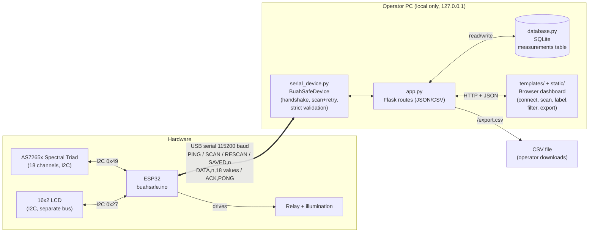
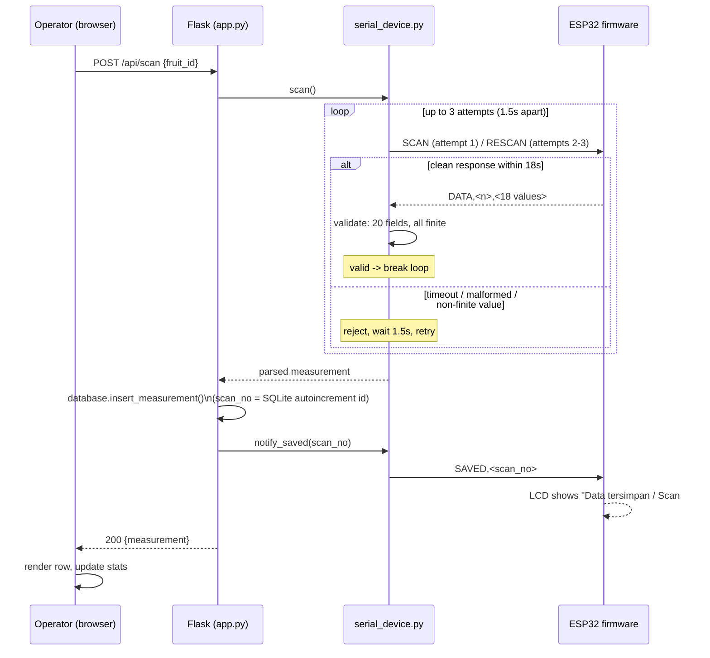

# Architecture and Data Flow

## One-paragraph description

BuahSafe Web Capture is a local, single-machine data-acquisition system for
building a guava (jambu biji) quality dataset. An ESP32 microcontroller
drives an AS7265x 18-channel spectral sensor (three physical chips: UV-VIS,
VIS, NIR) and a status LCD, communicating over a single USB-serial link at
115200 baud using a small newline-delimited text protocol. A local Flask web
application on the operator's PC owns that serial connection, drives the
scan sequence (with automatic retry on transient failure), validates every
reading before accepting it, and persists successful measurements to a local
SQLite database. Operators interact entirely through a browser-based
dashboard served by the same Flask process: connecting to the device,
triggering scans, labeling fruit as `bagus`/`rusak`, searching/filtering
history, and exporting the dataset as CSV for downstream analysis.

## Full program description

### Physical/firmware layer (`buahsafe.ino`)

- Reads the AS7265x Spectral Triad over a dedicated I2C bus (SDA GPIO21/SCL
  GPIO22) and drives a 16x2 status LCD over a second, separate I2C bus (SDA
  GPIO13/SCL GPIO14) so sensor and display traffic never contend for the
  same bus.
- Exposes a minimal command protocol over serial (see
  [`OPERATOR_AND_MAINTAINER_GUIDE.md`](OPERATOR_AND_MAINTAINER_GUIDE.md) for
  the full contract): `PING`, `SCAN`, `RESCAN`, `SAVED,<n>`.
- Runs an ESP32 hardware task watchdog (15s) so a genuine firmware hang
  reboots the chip instead of freezing indefinitely; the server detects and
  logs any such reboot rather than silently losing the evidence.
- Drives a relay (illumination) and buzzer (audible scan cue) as part of the
  scan sequence.

### Acquisition layer (`serial_device.py`)

- Owns the exclusive serial connection to the ESP32 (COM port discovery,
  connect/handshake, disconnect).
- Sends `SCAN`/`RESCAN`, waits for a `DATA,...` line with a bounded timeout
  (18s + up to 5s grace), and retries automatically up to 3 total attempts
  before giving up.
- Parses and validates every `DATA,...` line strictly: exactly 20
  comma-separated fields, all 18 spectral values finite floats. Any
  violation is rejected — never coerced to a placeholder value — and
  triggers a retry.
- Maintains an in-memory circular debug log (last 300 events) surfaced to
  the operator through the Debug Console panel, so failures are visible and
  traceable rather than silent.

### Application layer (`app.py`, `database.py`)

- Flask serves the dashboard and a small JSON/CSV API: connect/disconnect,
  scan, list/search/filter measurements, update label, delete one/many/all
  measurements, export CSV, read debug log.
- `database.py` owns the SQLite schema and is the single source of truth
  for `scan_no` (the database's own `AUTOINCREMENT` id — not whatever the
  ESP32's volatile RAM counter reports).
- Binds to `127.0.0.1` only; this is a local single-operator tool, not a
  networked service.

### Presentation layer (`templates/`, `static/`)

- Server-rendered HTML dashboard plus vanilla JS/CSS (no build step,
  single-file-per-concern) for connecting, scanning, reviewing/labeling the
  dataset table, and a client-side retry layer on top of the server's own
  retry, so a transient failure shows the operator progressive status text
  and a one-click "coba lagi" rather than a dead end.

## Component / data-flow diagram

## Scan sequence with automatic retry

This is the core reliability mechanism: every scan is validated before
acceptance, and transient serial/electrical noise is retried automatically
rather than surfaced to the operator as a hard failure.

## Known limitations

See the "Known limitations and claim boundaries" section in
[`OPERATOR_AND_MAINTAINER_GUIDE.md`](OPERATOR_AND_MAINTAINER_GUIDE.md) for
the current, evidence-dated list (updated 2026-08-17).
